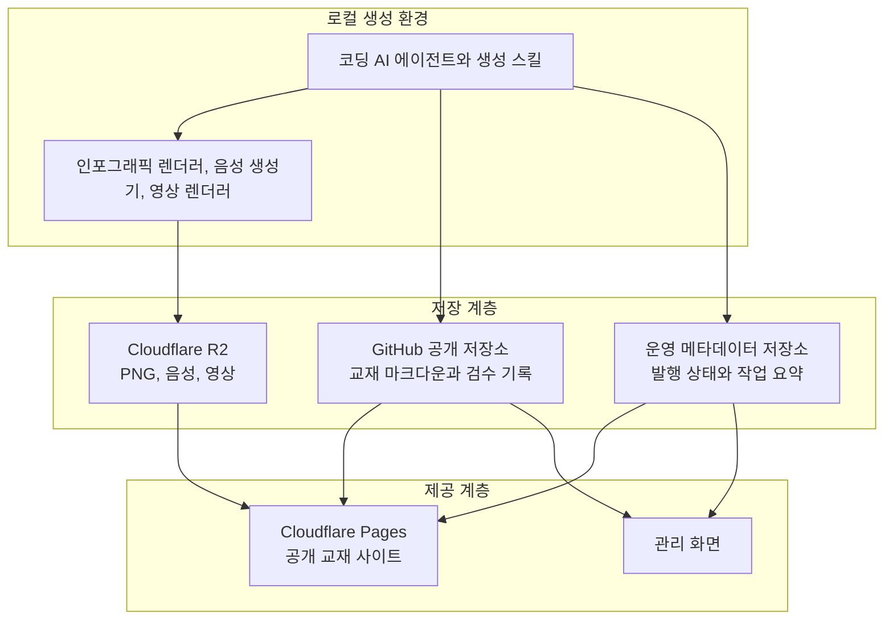
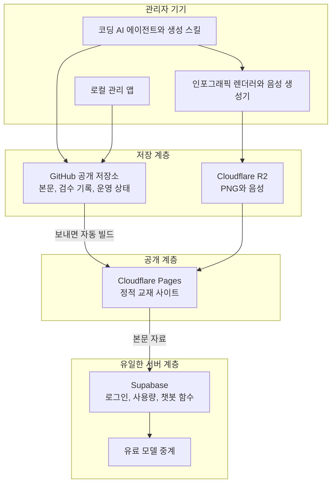

# 2026-08-21 저장소와 호스팅 아키텍처 결정

> Vault의 프로젝트 허브의 v2 재설계를 앞두고 "교재 본문, 미디어, 발행 상태를 각각 어디에 둘 것인가"를 정하는 문서다. manyfast에 작성된 v2 기획서가 Firebase를 전제로 하고 있으나, 조성배 교수님이 무료 운영을 원한다는 제약과 2026년 2월 Firebase 정책 변경이 겹치면서 그 전제가 성립하지 않게 되었다. 각 후보의 실제 무료 한도를 확인한 뒤 계층별로 다시 배치하는 것이 목적이다.

---

## 왜 지금 이 결정이 필요한가

Wikidox Agent는 2026년 5월 조성배 교수님과의 시연을 거쳐 공동 논문 주제로 확정되었고, 8월 초까지 문장 검수 게이트와 구조 검사층을 붙이며 콘텐츠 생산 파이프라인 쪽을 다졌다. 그 사이 manyfast에 별도로 v2 기획서가 작성되었는데, 이 기획서는 지금 돌아가고 있는 코드베이스와 다른 저장 구조를 전제한다. 현재 코드는 교재 본문을 저장소 안의 파일로 두고 `CHECKPOINT.json`으로 진행 상태를 넘기는 파일 기반 구조인 반면, v2 기획서는 프로젝트, 목차, 초안, 생성 기록, 스타일 버전을 모두 Firebase에 두는 구조로 쓰여 있다.

두 구조 중 어느 쪽이 맞는지는 취향의 문제가 아니라 비용의 문제로 판가름난다. 교수님 쪽 요구는 무료 운영이고, 이 제품은 텍스트뿐 아니라 인포그래픽 PNG와 음성 파일과 개요 영상을 함께 생산한다. 미디어 파일을 어디에 두느냐가 곧 매달 청구서가 발생하는지 여부를 결정한다. 그래서 "Firebase냐 파일이냐"라는 이분법이 아니라, **본문, 미디어, 사이트, 운영 메타데이터 네 계층을 각각 어디에 둘 것인가**로 문제를 쪼개어 보아야 한다.

비유하자면 이것은 책을 만드는 일과 비슷하다. 원고를 어디에 보관할지, 삽화와 오디오북 음원을 어디에 둘지, 완성된 책을 어느 서점에 진열할지, 재고와 판매 기록을 어느 장부에 적을지는 서로 다른 질문이다. 하나의 창고에 전부 넣으면 편하지만, 그 창고가 원고에는 공짜이고 음원에는 유료라면 계층을 나누는 편이 낫다.

---

## 결정을 가르는 제약 세 가지

### 제약 하나. Firebase Storage는 더 이상 무료 티어에 존재하지 않는다

이것이 이번 조사에서 확인된 가장 결정적인 사실이다. Cloud Storage for Firebase는 2024년 10월 30일부터 신규 프로젝트에 한해 Blaze 종량제 요금제를 요구했고, **2026년 2월 3일부터는 기존 프로젝트까지 포함해 예외 없이 전부 Blaze 필수**로 전환되었다. 무료 요금제인 Spark에서는 파일 저장소 자체를 켤 수 없다.

이 사실은 v2 기획서의 전제를 직접 무너뜨린다. 기획서는 인포그래픽 PNG와 개요 영상을 생성해 Firebase에 초안으로 등록하는 흐름을 핵심으로 삼고 있는데, 그 파일들을 담을 곳이 무료 요금제에는 없다. Firestore는 문서 데이터베이스이지 파일 저장소가 아니므로 영상을 넣을 수 없다.

다만 Firebase 전체가 못 쓰게 된 것은 아니다. Firestore는 Spark에서 하루 문서 읽기 5만 회, 쓰기 2만 회, 저장 용량 1GiB, 월 송신 10GiB까지 무료로 남아 있고, Authentication도 월간 활성 사용자 5만 명까지 무료다. 즉 **파일이 아닌 데이터, 그리고 로그인 처리는 여전히 Firebase 무료 범위 안에 있다**.

> **Sources**
> - [Firebase Storage 요금제 변경 안내](https://firebase.google.com/docs/storage/faqs-storage-changes-announced-sept-2024)
> - [Firebase 요금제](https://firebase.google.com/pricing)
> - [Firestore 할당량](https://firebase.google.com/docs/firestore/quotas)

### 제약 둘. Vercel 무료 요금제는 이 프로젝트에 쓰면 약관 위반 소지가 있다

현재 wikidox 포털은 Vercel에 배포되어 있다. 그런데 Vercel의 이용약관은 Hobby 요금제를 "개인적이거나 비상업적인 용도"로만 제한하고, Fair Use 가이드라인은 상업적 사용의 정의에 **"유급 직원이나 외주 인력이 코드를 작성한 프로젝트의 배포"**를 명시적으로 포함시킨다.

Wikidox Agent는 조성배 교수님 근로의 일부로 진행되고 있다. 즉 이 프로젝트의 코드는 급여를 받는 사람이 작성하고 있으며, 약관 문구를 문자 그대로 읽으면 Hobby 요금제 사용 조건에서 벗어난다.

여기서 "산출물이 무료 교육 콘텐츠이니 괜찮지 않은가"라는 반문이 자연스럽게 나온다. 2026년 8월 21일에 이 점을 따로 확인했고, 답은 아니었다. **Vercel의 판단 기준은 사이트가 무엇에 쓰이는지가 아니라 제작자가 대가를 받았는지다.** Fair Use Guidelines가 상업적 사용의 예시로 나열한 다섯 항목 중 하나가 이를 직접 보여 준다.

> "Receiving payment to create, update, or host the site"

교육, 학술, 연구, 비영리 목적에 대한 예외 조항은 이용약관과 Fair Use Guidelines 전문 어디에도 없다. Vercel 직원이 커뮤니티에서 답한 사례에서도 기준이 같았다. 무급 학생팀이 비영리 단체 사이트를 Hobby로 운영해도 되느냐는 질문에 "받는 사람이 아무도 없다"는 이유로 문제없다고 답했는데, 뒤집으면 급여를 받는 순간 기준을 넘는다는 뜻이다. 학생과 오픈소스를 대상으로 한 프로그램이 있으나 어느 것도 이 제한을 풀어 주지 않는다.

이것이 당장 서비스가 내려가는 종류의 위험은 아니다. 그러나 논문으로 공개할 시스템이고 교수님 이름이 함께 걸리는 이상, 배포 대상을 약관상 명확히 안전한 곳으로 옮겨 두는 편이 낫다. 이 부분은 무료냐 아니냐 이전에 규정 준수의 문제다. Cloudflare Pages로 옮기기로 한 결정이 이 문제까지 함께 해소한다.

> **Sources**
> - [Vercel 이용약관](https://vercel.com/legal/terms)
> - [Vercel Fair Use 가이드라인](https://vercel.com/docs/limits/fair-use-guidelines)

### 제약 셋. GitHub는 텍스트에 강하고 미디어에 약하다

교재 본문을 마크다운으로 GitHub 공개 저장소에 두는 안은 텍스트 관점에서 흠잡을 데가 없다. 저장소 크기 권장선이 1GB인데 마크다운 텍스트로 그 한도에 닿으려면 교재를 수천 권 써야 한다. 버전 관리, 이력 추적, 외부 검토, 논문 부록으로서의 공개성까지 덤으로 따라온다.

문제는 미디어다. 큰 파일을 Git으로 다루는 표준 방법인 Git LFS는 무료 할당이 저장 10GiB에 **월 대역폭 10GiB**다. 저장 용량은 견딜 만하지만 대역폭이 문제다. 대역폭은 파일을 내려받을 때마다 소모되므로, 개요 영상 하나가 50MB라고 하면 월 200회 재생이면 할당이 바닥난다. 강의 하나를 수강생 서른 명이 두세 번씩 돌려보면 한 달을 못 버틴다.

정리하면 GitHub는 원고 창고로는 최적이지만 음원과 영상 창고로는 부적합하다.

> **Sources**
> - [GitHub 대용량 파일 안내](https://docs.github.com/en/repositories/working-with-files/managing-large-files/about-large-files-on-github)
> - [Git LFS 과금 안내](https://docs.github.com/en/billing/managing-billing-for-git-large-file-storage/about-billing-for-git-large-file-storage)

---

## 계층별 후보 비교

### 계층 1. 교재 본문

| 후보 | 무료 성립 | 강점 | 약점 |
| --- | --- | --- | --- |
| GitHub 공개 저장소의 마크다운 | 성립 | 이력 추적, 외부 검토, 논문 부록으로 그대로 공개 가능, 지금 코드가 이미 파일 기반 | 동시 편집 충돌을 커밋 단위로 다뤄야 함 |
| Firestore 문서 | 성립 | 웹 관리 화면에서 즉시 수정 반영, 잠금과 버전 비교가 쉬움 | 저장 1GiB 한도, 본문이 저장소 밖으로 나가 논문 재현성이 떨어짐 |

본문은 **GitHub 공개 저장소의 마크다운**이 우세하다. 이유는 세 가지다. 첫째, 현재 코드가 이미 그 구조로 돌아가고 있어 이행 비용이 없다. 둘째, 품질 검수 게이트가 원문 지문을 기준으로 무효화를 판정하는데, 파일과 커밋 해시가 그 지문 역할을 그대로 해준다. 셋째, 공동 논문으로 발표할 때 "생성된 교재 전문"을 저장소 링크 하나로 공개할 수 있다.

### 계층 2. 미디어 자산

| 후보 | 무료 저장 | 무료 전송 | 판정 |
| --- | --- | --- | --- |
| Firebase Storage | 없음 | 없음 | 사용 불가, Blaze 필수 |
| GitHub Git LFS | 10GiB | 월 10GiB | 대역폭 부족으로 부적합 |
| Cloudflare R2 | 10GB | 무제한, 송신 과금 없음 | 적합 |
| Backblaze B2 | 10GB | 월평균 저장량의 3배 | 차선책 |

미디어는 **Cloudflare R2**가 명확히 앞선다. R2의 설계상 특징인 송신 무과금이 무료 티어에도 그대로 적용되기 때문이다. 즉 영상이 몇 번 재생되든 전송 비용이 발생하지 않고, 오직 저장 용량 10GB만 신경 쓰면 된다. 쓰기 계열 작업 월 100만 회, 읽기 계열 월 1000만 회 한도는 이 규모에서는 사실상 무제한이다.

Backblaze B2도 저장 10GB가 무료이고 송신은 월평균 저장량의 3배까지 무료라 소규모에서는 충분하지만, 3배라는 상한이 존재한다는 점에서 R2보다 한 단계 아래다.

> **Sources**
> - [Cloudflare R2 요금](https://developers.cloudflare.com/r2/pricing/)
> - [Backblaze B2 요금](https://www.backblaze.com/cloud-storage/pricing)

### 계층 3. 공개 사이트 배포

| 후보 | 무료 성립 | 상업적 사용 제한 | 주요 한도 |
| --- | --- | --- | --- |
| Cloudflare Pages | 성립 | 공식 문서에 명시적 비상업 조항 없음 | 파일 2만 개, 단일 파일 25MiB, 빌드 월 500회 |
| GitHub Pages | 성립 | 없음 | 사이트 1GB, 월 대역폭 100GB 권고 |
| Vercel Hobby | 성립하나 약관 위반 소지 | 비상업 전용, 유급 제작 관여 포함 | 월 100GB 전송 |

배포는 **Cloudflare Pages**를 권한다. 약관상 안전하고, 미디어를 R2에 두면 같은 사업자 안에서 연결되어 운영이 단순해진다. 단일 파일 25MiB 상한이 있지만 미디어를 R2로 빼면 사이트에는 텍스트와 작은 이미지만 남으므로 걸릴 일이 없다.

GitHub Pages도 약관상 문제가 없고 본문 저장소와 같은 곳에 있다는 이점이 있으나, 서버 측 함수 실행이 불가능해 챗봇 같은 후속 기능을 붙일 때 별도 수단이 필요해진다. Cloudflare Pages는 Functions로 하루 10만 요청까지 무료로 처리할 수 있어 확장 여지가 크다.

### 계층 4. 운영 메타데이터와 발행 상태

여기가 유일하게 판단이 갈리는 지점이다. 발행 상태, 검수 통과 여부, 생성 작업 요약 기록, 챗봇 대화 기록을 어디에 둘 것인가.

파일에 두는 방식은 이미 `CHECKPOINT.json`으로 부분적으로 구현되어 있다. 단순하고 추가 비용이 없으며 논문 재현성이 좋다. 그러나 관리 화면에서 여러 관리자가 동시에 상태를 바꾸는 상황을 다루기 어렵고, 챗봇 대화처럼 자주 쓰이는 데이터에는 맞지 않는다.

Firestore에 두는 방식은 그 반대다. 동시성과 잦은 쓰기에 강하고 무료 한도도 이 규모에는 충분하다. 대신 시스템이 두 개의 사업자에 걸치게 되고, 본문과 상태가 서로 다른 곳에 있어 "이 커밋 시점의 발행 상태는 무엇이었나"를 되짚기 어려워진다.

Cloudflare 생태계로 통일한다면 D1이나 KV를 쓰는 세 번째 선택지도 있다. Pages와 R2를 이미 쓰고 있다면 사업자를 하나로 묶는 이점이 있으나, Firebase Authentication만큼 손쉬운 로그인 수단이 딸려 오지는 않는다.

---

## 권장 구성

> 아래 그림은 이 문서를 쓰던 시점의 중간 결론이며 **최종안이 아니다.** 뒤의 확정된 결정에서 관리 화면은 로컬 앱으로 바뀌었고, 영상 렌더러는 아예 사라졌으며, 챗봇 계층이 새로 붙었다. 최종 구성은 #확정된 전체 구성 아래의 그림을 봐야 한다.

정리하면 다음과 같다. 교재 본문과 검수 기록은 GitHub 공개 저장소의 파일로 두고, 인포그래픽과 음성과 영상은 Cloudflare R2에 올려 사이트에서는 주소만 참조한다. 공개 사이트는 Cloudflare Pages로 배포하며, Vercel 배포는 약관 문제로 정리한다. 운영 메타데이터 계층만 결정을 남긴다.

이 구성에서 유료가 강제되는 지점은 하나뿐이다. 미디어 총량이 10GB를 넘는 순간이다. 개요 영상 한 편을 30MB로 잡으면 대략 330편, 교재 한 권에 열 편씩 붙인다고 하면 교재 서른 권 분량이다. 그 지점에 닿으면 오래된 교재의 영상을 내려받아 보관하고 저장소에서 지우는 방식으로 더 늘릴 수 있고, 그래도 부족해지면 그때 유료 전환을 논의하면 된다.

---

## 이 결정이 기존 코드와 기획서에 미치는 영향

기획서 쪽에서는 Firebase를 언급한 모든 항목을 다시 써야 한다. manyfast 문서에서 Firebase는 저장소, 인증, 초안 등록처, 스타일 설정 보관처 네 가지 역할을 동시에 맡고 있는데, 이 중 파일을 담는 역할은 성립하지 않으므로 각 역할을 어느 계층이 맡을지 다시 배분해야 한다.

코드 쪽에서는 세 가지가 바뀐다. 첫째, 영상 처리 방식이다. 현재 코드는 서버에서 mp4를 만들지 않고 클라이언트에서 Remotion Player로 재생하는 방식을 택했는데, v2 기획서는 서버에서 mp4를 렌더링해 저장하는 방식으로 쓰여 있다. R2에 미디어를 두기로 하면 서버 렌더링 방식이 자연스럽지만, 클라이언트 재생 방식은 영상 파일 자체가 없어 저장 용량을 거의 쓰지 않는다는 큰 이점이 있다. 무료 10GB 제약을 생각하면 이 선택은 다시 검토할 값어치가 있다.

둘째, 음성 생성 도구다. 코드는 Qwen3 계열 음성 합성으로 목소리를 만들고 있는데 기획서에는 다른 도구가 적혀 있다. 셋째, 배포 대상이 Vercel에서 Cloudflare Pages로 바뀐다면 Next.js 애플리케이션의 빌드 산출 방식을 정적 출력으로 맞추는 작업이 필요하다.

---

## 확정된 결정

2026년 8월 21일에 남은 세 가지를 모두 정했다.

**운영 메타데이터는 저장소 안의 파일로 둔다.** 발행 상태, 검수 통과 여부, 생성 작업 요약, 스타일 버전을 모두 교재 폴더와 공통 경로의 파일로 관리한다. 이로써 추가 사업자가 하나도 생기지 않고, 본문과 검수 기록이 같은 변경 이력에 남아 지문 비교로 무효화를 판정하는 게이트가 별도 장치 없이 성립한다. 대가로 관리 화면의 편집은 파일 변경으로 이어지므로 동시 편집 충돌을 커밋 단위로 다뤄야 한다.

**개요 영상은 지금처럼 클라이언트에서 조립해 재생한다.** 서버에서 영상 파일을 만들지 않으므로 무료 저장 한도 10GB를 거의 쓰지 않게 된다. 객체 저장소에 올라가는 것은 인포그래픽 이미지와 음성 파일뿐이다. 대가로 영상을 파일로 내려받거나 다른 곳에 올리는 일은 불가능하며, 재생 준비에 짧은 대기가 생긴다.

**관리 도구는 인터넷에 서비스하지 않고 관리자의 기기에서 실행하는 로컬 앱으로 만든다.** 처음에는 관리 화면을 호스팅하고 Cloudflare Access로 접근을 통제하는 안을 검토했으나, 한 걸음 물러서 보니 그 통제 자체가 필요 없는 구조가 가능했다.

교재와 운영 상태가 모두 저장소의 파일이 된 이상 관리 도구가 하는 일은 파일을 읽고 쓰는 것뿐이다. 그것을 인터넷에 올리려면 서버와 인증과 저장소 쓰기 자격 증명이 한꺼번에 따라붙지만, 관리자의 기기에서 로컬 작업 복사본을 직접 다루면 셋 다 사라진다. 로그인 화면도, 사용자 목록도, 세션도, 서버에 보관할 토큰도 두지 않는다.

권한 모델도 새로 만들 필요가 없다. **저장소에 쓸 수 있는 사람이 곧 교재를 다룰 수 있는 사람**이고 그 판단은 저장소가 이미 하고 있다. 기획서가 여덟 번 반복하면서도 정의하지 않았던 "운영 조직의 승인 절차"는 저장소 협업자 목록으로 대체된다. 교재를 다루는 사람은 어차피 코딩 에이전트와 저장소를 쓰는 사람이므로 로컬 실행이 부담이 되지도 않는다.

덤으로 편집 기능이 오히려 되살아난다. 호스팅하는 관리 화면에서 본문을 고치려면 서버가 저장소에 커밋해야 하고 동시 편집 충돌과 버전 번호 매핑을 전부 정의해야 했다. 로컬에서는 파일을 그냥 쓰면 되고, 충돌은 저장소의 병합 기능이 이미 해결해 둔 문제다.

대신 경계가 하나 생긴다. **로컬에서 고친 것은 저장소로 보내야 공개 사이트에 반영된다.** 보내기 전까지는 내 기기 안의 일이다. 이 경계를 관리 앱이 늘 분명히 보여 주어야 하며, 그래서 보내지 않은 변경 건수를 항상 표시하는 화면을 따로 두었다.

발행과 숨김도 같은 원리로 풀린다. 발행 여부는 별도 데이터베이스에 담을 상태가 아니라 교재 정보 파일 안의 값 한 줄이다. 그 값을 바꾸고 저장소로 보내면 정적 사이트가 다시 빌드되면서 반영된다. 값을 바꾸는 일은 로컬 관리 앱의 발행 버튼으로도, 로컬 에이전트의 발행 명령으로도 할 수 있고 둘 다 세 검수의 통과 여부를 먼저 확인한다.

### 챗봇을 1차 출시에 넣기로 하면서 서버가 되살아났다

여기까지의 구성은 서버가 하나도 없다는 점이 가장 큰 미덕이었다. 그런데 학습자 질문 응답 챗봇을 다음 출시로 미루지 않고 1차 범위에 넣기로 하면서 전제가 하나 깨졌다. 모델을 호출하려면 열쇠가 필요하고, 그 열쇠는 브라우저에 둘 수 없다. 브라우저에 둔 열쇠는 열쇠가 아니라 공개된 문자열이다.

그래서 최소한의 서버가 필요해졌다. 문제는 그 최소한이 실제로는 얼마나 되느냐다. 열쇠를 감추는 중계만 두면 아무나 무한히 부를 수 있으니 누가 몇 번 불렀는지 세야 하고, 그러려면 사람을 구분해야 하며, 사람을 구분하려면 로그인이 있어야 하고, 로그인이 있으면 세션과 계정 저장이 따라온다. 결국 중계 하나가 인증과 데이터베이스를 끌고 온다.

**후보는 셋이었다.** 직접 만드는 안, Firebase, Supabase다.

직접 만드는 안은 무료라는 점을 빼면 좋을 게 없었다. Cloudflare Pages Functions에 D1을 붙이면 비용은 0이지만 구글 로그인 흐름, 토큰 검증, 세션 갱신, 사용량 테이블을 전부 손으로 짜야 한다. 이 프로젝트에서 손으로 짠 코드는 곧 인수인계 부담이 되며, 2027년 1월 이후 이 시스템을 물려받을 사람이 읽어야 할 분량이 늘어난다.

Firebase는 2026년 2월 3일부터 Cloud Functions가 유료 요금제를 전제하게 되면서 애초에 이 결정을 촉발한 바로 그 이유로 탈락했다. 저장 계층에서 이미 한 번 밀려난 사업자를 인증 계층에서 다시 부를 이유가 없다.

**Supabase를 선택했다.** 구글 로그인, 사용자 테이블, 세션 관리, 서버 함수가 한 묶음으로 오고, 사용자별 접근 제어가 데이터베이스 층에 내장되어 있어 남의 대화를 조회하는 종류의 사고를 코드가 아니라 규칙으로 막는다. 남는 일은 챗봇 함수 하나와 사용량 테이블 하나뿐이다.

**무료로 시작하되 언제 유료로 바꿀지를 미리 못 박는다.** 무료 요금제는 한동안 아무도 쓰지 않으면 프로젝트를 자동으로 멈춘다. 개발 중에는 매주 손대므로 드러나지 않지만, 학기 방학이나 인수인계 공백기처럼 아무도 접속하지 않는 기간에는 그대로 발생할 수 있는 조건이다.

그래서 전환 시점을 사람의 판단이 아니라 사건으로 정의했다. **교재 링크가 나와 교수님 밖으로 처음 나가는 날**, 곧 수업 공지에 올리거나 학생에게 배포하는 시점 이전에 유료로 전환한다. 그 전까지는 무료로 충분하고, 그 뒤로는 무료로 두면 안 된다.

이 시점을 놓쳐도 무너지는 방식이 완만하다는 점은 다행이다. 공개 사이트는 정적이고 미디어는 객체 저장소에 있으므로 백엔드가 멈춰도 교재는 그대로 읽힌다. 죽는 것은 챗봇 하나뿐이다. 다만 챗봇이 조용히 실패하면 방문자는 자기 질문이 이상해서 답이 없는 줄 알게 되므로, 지금 쓸 수 없는 상태임을 화면에 분명히 알리도록 정했다.

**저장 리전은 서울로 정했다.** 사용자가 한국에 있고 교재도 한국어이므로 응답이 빠르고, 학습자의 이름과 메일 주소가 국내에 머문다. 리전은 프로젝트를 만든 뒤에는 바꿀 수 없고 바꾸려면 새 프로젝트로 데이터를 옮겨야 하므로, 만드는 시점에 반드시 확인해야 하는 값이다.

다만 서울에 둬도 **질문 내용 자체는 해외로 나간다.** 모델을 부르는 곳이 해외 사업자이기 때문이다. 그래서 실제 구도는 계정 정보는 국내, 질문 내용은 해외가 되며, 개인정보 처리방침의 국외 이전 항목은 여전히 필요하다. 나가는 범위가 줄어들 뿐 사라지지는 않는다.

모델 호출은 유료 OpenRouter로 한다. 무료 한도에 맞춰 설계를 비트는 대신 비용을 내고 한도를 사는 쪽이 낫다는 판단이며, 실제로 드는 비용은 질문 한 건당 몇 원 수준이다. 대신 비용 상한은 두 겹으로 건다. 사용자별 하루 한도만 두면 사람 수가 늘어날 때 전체 비용을 막지 못하므로, 전체 사용량 상한을 함께 둔다. 한도 검증은 서버 안에서 원자적으로 수행해 클라이언트를 건너뛴 직접 호출로 우회되지 않게 한다.

**챗봇이 초안을 볼 수 없다는 것은 규칙이 아니라 구조로 보장한다.** 챗봇 백엔드는 저장소에 접근하지 않고 공개 배포 산출물만 읽는다. 그 산출물에는 검수를 통과하지 못한 교재가 애초에 들어가지 않으므로, 챗봇이 미발행 본문을 답변에 쓸 경로 자체가 존재하지 않는다.

### 확정된 전체 구성

| 계층 | 선택 | 무료 한도 |
| --- | --- | --- |
| 교재 본문, 검수 기록, 운영 메타데이터 | GitHub 공개 저장소의 파일 | 저장소 1GB 권장선, 텍스트로는 사실상 무제한 |
| 인포그래픽 이미지, 음성 | Cloudflare R2 | 저장 10GB, 송신 무과금 |
| 개요 영상 | 파일로 만들지 않고 브라우저에서 조립 | 저장 소모 없음 |
| 공개 사이트 배포 | Cloudflare Pages, 저장소에 보내면 자동 빌드 | 파일 2만 개, 단일 파일 25MiB, 빌드 월 500회 |
| 관리 도구 | 관리자 기기에서 실행하는 로컬 앱 | 비용 없음, 인증 계층 없음 |
| 관리 권한 | 저장소 쓰기 권한이 곧 관리 권한 | 별도 계정 체계 없음 |
| 계정 소유자 | 네 서비스 모두 venturers.team@gmail.com 명의 | 개인 이름으로 흩어지지 않게 한 계정으로 모음 |
| 학습자 로그인과 챗봇 서버 | Supabase Auth, Postgres, Edge Functions, 서울 리전 | 무료로 시작, 공개 시점에 월 25달러로 전환 |
| 모델 호출 | 유료 OpenRouter | 무료 한도에 기대지 않음, 사용자별과 전체 이중 상한 |

위 그림에서 눈여겨볼 것은 **화살표가 없는 자리**다. 챗봇 서버에서 저장소로 가는 화살표가 없다. 서버는 공개 배포 산출물만 읽으므로 초안에 닿을 경로가 구조적으로 존재하지 않는다. 로컬 관리 앱에서 공개 사이트로 직접 가는 화살표도 없다. 고친 것은 저장소를 거쳐야만 공개된다.

교재를 만들고 공개하는 흐름에서 유료가 강제되는 지점은 인포그래픽과 음성의 총량이 10GB를 넘는 순간 하나뿐이다. 그 밖의 비용은 전부 챗봇 계층에 몰려 있으므로, 챗봇을 끄면 나머지는 예산 없이 계속 돌아간다.

### 아직 정하지 않은 것

음성 생성 도구를 무엇으로 할지는 이 결정에 포함하지 않았다. 저장 방식과 배포 구성에는 영향을 주지 않으므로 개발 착수를 막지는 않는다.

다만 기획서에 적혀 있던 VoiceBox는 후보에서 빠진다. Meta가 가중치를 공개하지 않았고 커뮤니티 재구현에도 학습된 가중치가 없어 지금 쓸 수 있는 물건이 아니기 때문이다. 검토 경과와 대안은 음성 합성 운율 검토 기록에 정리했다. 현재 방향은 Qwen3-TTS를 유지한 채 생성 단위를 바꿔 보고, 부족하면 CosyVoice 2 또는 Chatterbox로 옮기는 것이다.

조사 근거는 무료 티어 한도 조사 기록에, 화면 단위 설계는 [2026-08-21-v2-정보구조-IA](04-화면-구조.md)에 정리해 두었다. 이 결정은 manyfast 기획서에 반영을 마쳤으며 Vault의 프로젝트 허브에도 기록한다.
