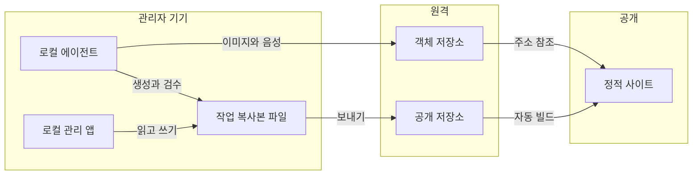
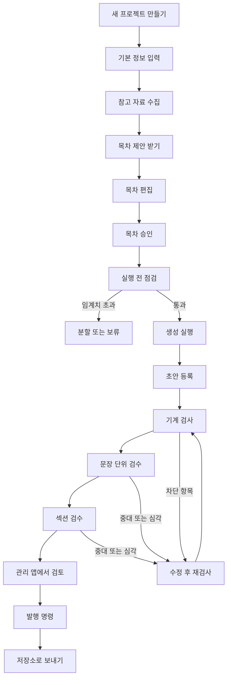

# 2026-08-21 v2 정보 구조

> [2026-08-21-저장소-호스팅-아키텍처-결정](03-아키텍처-결정.md)에서 정한 구성과 manyfast v2 기획서의 요구사항을 화면 단위로 옮긴 문서다. 와이어프레임을 그리기 전 단계로, 어떤 화면이 몇 개 있고 각 화면이 무엇을 하며 어떤 조작 수단을 두는지만 정한다. 색, 여백, 배치, 컴포넌트 선택 같은 디자인 결정은 여기서 다루지 않는다.

---

## 이 문서가 답하는 것과 답하지 않는 것

정보 구조는 건물의 평면도에 해당한다. 방이 몇 개이고 어느 방에서 어느 방으로 갈 수 있으며 각 방에서 무엇을 할 수 있는지를 정하지만, 벽지 색이나 가구 배치는 정하지 않는다. 이 문서도 화면 목록, 화면 사이의 이동 경로, 각 화면이 담는 기능, 그 기능을 실행하는 조작 수단까지만 정의한다.

와이어프레임 단계에서 정할 것은 여기서 정한 요소들을 화면 위 어디에 어떤 크기로 놓을지다. 그 단계로 넘어가기 전에 요소 자체가 빠짐없이 정해져 있어야 나중에 화면을 다시 그리는 일이 줄어든다.

---

## 두 개의 표면과 하나의 명령 흐름

이 제품이 사람과 만나는 자리는 넷이고, 서로 성격이 아주 다르다.

첫째는 **공개 사이트**다. 로그인 없이 누구나 들어와 발행된 교재를 읽는다. 정적으로 미리 만들어 둔 페이지를 내보내며 서버가 없다.

둘째는 **로컬 관리 앱**이다. 인터넷에 서비스하지 않고 관리자의 기기에서만 실행한다. 저장소를 내려받은 로컬 작업 복사본의 파일을 직접 읽고 쓴다.

셋째는 **로컬 에이전트**다. 화면이 아니라 명령 흐름이다. 새 프로젝트를 만들고 목차를 승인하고 생성을 실행하고 검수를 돌린다.

넷째는 **챗봇 백엔드**다. 이것만은 화면이 아니라 인터넷에서 도는 서버이며, 이 시스템에서 유일하게 서버가 필요한 자리다. 공개 사이트에 얹히는 부유형 챗봇 패널이 이 서버를 부르고, 서버가 학습자를 구분하고 질문 횟수를 세고 모델을 호출한다. 나머지 셋과 달리 무료로 성립하지 않으며, 멈춰도 교재 열람에는 영향을 주지 않도록 경계를 두었다.

### 왜 관리 도구를 로컬에 두는가

교재와 운영 상태가 모두 저장소의 파일이 된 이상, 관리 도구가 할 일은 파일을 읽고 쓰는 것뿐이다. 그것을 인터넷에 서비스하려면 서버와 인증과 저장소 쓰기 자격 증명이 한꺼번에 필요해진다. 반면 관리자의 기기에서 돌리면 그 셋이 통째로 사라진다. 로그인 화면도, 사용자 목록도, 세션도, 서버에 보관할 토큰도 필요 없다.

권한 모델도 새로 만들지 않는다. **저장소에 쓸 수 있는 사람이 곧 교재를 다룰 수 있는 사람**이며, 그 판단은 저장소가 이미 하고 있다. 교재를 다루는 사람은 어차피 코딩 에이전트와 저장소를 쓰는 사람이므로 로컬 실행이 부담이 되지도 않는다.

대신 한 가지가 바뀐다. 로컬에서 고친 내용은 **저장소로 보내야 공개 사이트에 반영된다.** 보내기 전까지는 내 기기 안의 일이다. 이 경계를 화면이 늘 분명히 보여 주어야 한다.

---

## 주소 구조

공개 사이트의 주소는 세 단계를 넘지 않는다. 짧고 예측 가능해야 학습자에게 링크를 건네기 쉽고, 검색 결과에서도 주소만 보고 무엇을 다루는지 짐작할 수 있다.

| 주소 | 화면 | 접근 |
| --- | --- | --- |
| `/` | 발행 교재 목록 | 누구나 |
| `/{교재슬러그}` | 교재 상세와 목차 | 누구나 |
| `/{교재슬러그}/{섹션슬러그}` | 섹션 본문 | 누구나 |
| `/sitemap.xml`, `/robots.txt` | 수집 정보 | 검색 수집기 |

교재 슬러그는 교재를 처음 만들 때 제목에서 자동으로 만들며, 한글 제목은 국어의 로마자 표기법을 따라 옮긴다. 영문 소문자와 숫자와 붙임표만 쓰고, 같은 슬러그가 이미 있으면 뒤에 일련번호를 붙인다. 한 번 발행한 교재의 슬러그는 제목을 바꾸어도 그대로 둔다.

로컬 관리 앱은 관리자의 기기에서만 열리는 주소를 쓴다. 공개 사이트와 주소 공간이 겹치지 않으므로 관리 경로를 공개 주소 아래에 두지 않는다.

---

## 공개 사이트

### 화면 1. 발행 교재 목록

발행 상태인 교재를 모아 보여 주는 첫 화면이다. 초안과 숨김 상태의 교재는 목록에도 검색 수집 대상에도 들어가지 않는다.

**기능**
- 발행 교재의 제목, 한 줄 설명, 대상 학습자, 난이도, 섹션 수, 예상 학습 시간, 마지막 발행일 표시
- 대상 학습자와 난이도로 좁혀 보기
- 제목과 설명에서 찾기
- 발행일 순서와 제목 순서 사이 전환

**조작 수단**
- 교재 카드 (누르면 교재 상세로 이동)
- 대상 학습자 선택 수단
- 난이도 선택 수단
- 검색 입력창
- 정렬 기준 선택 수단
- 조건 초기화 버튼

**빈 상태**: 발행된 교재가 하나도 없으면 아직 공개된 교재가 없다는 안내만 표시한다.

### 화면 2. 교재 상세와 목차

교재 하나의 전체 구조를 보여 준다. 학습자가 어디서부터 읽어야 하는지, 전체가 얼마나 되는지 가늠하는 자리다.

**기능**
- 교재 제목, 학습 목표, 대상 학습자, 난이도, 예상 학습 시간 표시
- 섹션 목차를 권장 학습 순서대로 표시
- 각 섹션의 제목과 한 줄 요약 표시
- 교재 개요 영상 재생
- 참고 자료 출처와 사용 조건 표시

**조작 수단**
- 첫 섹션부터 시작 버튼
- 섹션 목록 항목 (누르면 해당 섹션으로 이동)
- 개요 영상 재생 및 정지 수단
- 자막 표시 전환 수단
- 출처 목록 펼치고 접는 수단

**영상에 관한 주의**: 개요 영상은 미리 만들어 둔 영상 파일이 아니라 음성과 화면 정의를 브라우저가 받아 조립해 재생한다. 따라서 재생 준비에 짧은 대기가 생길 수 있고, 그 사이 상태를 알리는 표시가 필요하다. 파일을 내려받는 수단은 두지 않는다.

### 화면 3. 섹션 페이지

학습자가 실제로 읽는 화면이다. 본문과 인포그래픽과 섹션 개요 영상이 함께 놓인다.

**기능**
- 섹션 본문 표시
- 인포그래픽 이미지와 그 대체 설명 표시
- 섹션 개요 영상 재생과 자막 표시
- 같은 교재 안에서 이전 섹션과 다음 섹션으로 이동
- 현재 교재의 전체 목차 열어 보기
- 본문 안 소제목으로 바로 이동
- 핵심 개념과 요약 표시

**조작 수단**
- 이전 섹션 버튼과 다음 섹션 버튼
- 목차 열기 버튼
- 본문 안 소제목 목록 항목
- 인포그래픽 확대해 보기 수단
- 영상 재생과 정지와 자막 전환 수단
- 맨 위로 이동 버튼

**접근성 요건**: 모든 조작 수단은 마우스 없이 키보드만으로 닿고 실행할 수 있어야 한다. 인포그래픽에는 대체 설명이, 영상에는 자막이나 텍스트 요약이 반드시 함께 있어야 한다. 상태 변화와 오류 안내를 색으로만 전달하지 않는다.

### 화면 4. 접근할 수 없는 주소 안내

없는 주소이거나 숨김 또는 초안 상태인 교재의 주소로 들어왔을 때 보여 주는 화면이다.

**기능**
- 해당 주소의 내용을 볼 수 없다는 안내
- 다른 발행 교재로 이동할 경로 제공

**조작 수단**
- 교재 목록으로 이동 버튼

내부 구조를 드러내지 않는 것이 중요하다. 초안이 존재하지만 아직 공개되지 않았다는 사실 자체를 알려 주지 않고, 없는 주소와 같은 안내를 보여 준다.

---

### 화면 5. 부유형 챗봇 패널

섹션 페이지 위에 얹히는 패널이다. 별도 주소를 갖지 않고, 읽던 자리를 떠나지 않은 채 열리고 닫힌다.

**기능**
- 지금 읽고 있는 섹션의 본문을 문맥으로 삼아 질문에 답한다
- 로그인하지 않은 방문자에게는 로그인이 필요하다는 안내와 로그인 버튼을 보여 준다
- 남은 오늘 질문 횟수를 표시한다
- 한도에 도달하면 다음 날 다시 쓸 수 있다는 안내로 바꾼다
- 백엔드가 응답하지 않으면 지금 쓸 수 없는 상태임을 알린다

**조작 수단**
- 패널 열기와 닫기 버튼
- 질문 입력창과 보내기
- 로그인 버튼
- 대화 지우기

**규칙**

챗봇은 **닫혀 있는 상태가 기본**이다. 교재를 읽으러 온 사람이 읽기를 방해받지 않아야 하고, 챗봇 백엔드가 멈춰 있어도 페이지가 그대로 열려야 하기 때문이다. 패널을 열기 전까지는 서버를 부르지 않는다.

로그인은 열람을 막는 장치가 아니다. **질문 횟수를 사람 단위로 세기 위한 것뿐이며**, 로그인하지 않아도 교재는 전부 읽을 수 있다. 이 점을 로그인 안내 문구에 그대로 적어, 로그인하지 않으면 교재를 못 읽는다고 오해하지 않게 한다. 관리 권한과도 아무 관계가 없다.

챗봇이 참고하는 본문은 저장소가 아니라 **공개 배포 산출물에 함께 실린 본문 자료**다. 그 산출물에는 검수를 통과하지 못한 교재가 애초에 들어가지 않으므로, 챗봇이 초안을 답변에 쓸 경로 자체가 없다.

실패는 조용히 넘기지 않는다. 서버가 응답하지 않거나 한도를 넘겼을 때 답이 그냥 안 오면 방문자는 자기 질문이 이상해서 그런 줄 안다. 어느 쪽인지 구분해 화면에 적는다.

---

## 로컬 관리 앱

> **2026-08-24 결정으로 GUI 앱은 1차 범위에서 빠졌다.** 아래 화면 6~14는 화면 명세가 아니라 **운영 도구(자동 생성 상태 보드 `ops/STATUS.md`, 생성 스킬의 명령, 운영 CLI, 공개 사이트의 로컬 미리보기 모드)가 충족해야 할 기능 요구사항 목록**으로 읽는다. 특히 화면 6의 대시보드 역할은 상태 보드 파일이 맡는다. 각 화면의 "기능" 항목은 유효하고, "조작 수단" 항목은 GUI를 전제하므로 명령 인터페이스로 옮겨 해석한다. 판정 근거는 [관리 도구와 백엔드 재검토](09-관리-도구와-백엔드-재검토.md)에, 기능과 명령의 대응은 [구현 계획](08-구현-계획.md)의 6단계에 있다. 비개발자 관리자가 생기면 이 목록 그대로 GUI를 붙인다.

앱을 실행하면 지정한 작업 복사본 경로의 파일을 읽는다. 로그인 화면은 없다.

### 화면 6. 홈, 교재 목록과 지표

관리자가 앱을 열면 처음 보는 화면이고, 지금 무엇을 해야 하는지 판단하는 자리다.

**기능**
- 세 지표의 현재 값 표시: 전체 콘텐츠 생성 완료율, 생성 파이프라인 오류율, 첫 검토 가능 초안 소요 시간의 중앙값
- 각 지표에 집계 기간과 집계 대상 작업 수를 함께 표시
- 교재 목록 표시: 제목, 상태, 초안 등록 시각, 마지막 수정 시각, 발행 확정 시각, 검토 상태
- 세 검수의 통과 여부를 교재마다 각각 표시
- 검토가 필요한 교재를 앞에 놓기
- 미디어 저장 총량과 무료 한도 대비 비율 표시
- 저장소로 보내지 않은 변경 건수 표시
- 현재 작업 복사본 경로와 브랜치 표시

**조작 수단**
- 교재 목록 항목 (누르면 교재 상세로 이동)
- 상태로 좁혀 보기 수단
- 검색 입력창
- 스타일 설정 관리로 이동하는 수단
- 검수 기준 문서 관리로 이동하는 수단
- 작업 기록으로 이동하는 수단
- 미디어 자산 화면으로 이동하는 수단
- 공개 사이트 열기 수단

지표를 첫 화면에 두는 이유는 이 값들이 목표로만 적히고 실제로는 측정되지 않는 상태를 막기 위해서다. 값을 보려면 별도 집계가 필요하다면 아무도 보지 않게 되고, 그러면 완료율 90퍼센트라는 목표는 문서 안에만 남는다.

### 화면 7. 교재 상세와 검수 결과

교재 하나의 현재 상태를 모아 보고 발행 여부를 판단하는 자리다.

**기능**
- 교재 기본 정보 표시: 제목, 주제, 대상 학습자, 난이도, 학습 목표, 예상 학습 시간, 적용된 스타일 버전
- 섹션 목록과 각 섹션의 상태 표시
- 기계 검사 결과 표시: 차단 항목과 경고 항목을 구분하고 각 항목의 코드와 설명과 위치 표시
- 문장 단위 검수 결과 표시: 문제가 발견된 문장, 다섯 차원 점수, 등급, 검수자가 적은 이유
- 섹션 검수 결과 표시: 섹션별 다섯 차원 점수, 빠진 항목, 문제 항목
- 검수 회차 이력 표시: 회차 번호, 시작 시각, 무효화된 판정 수, 무결점 완주 여부
- 검수 시점 콘텐츠의 지문과 현재 지문이 같은지 표시
- 권리 검토 대상 미디어의 남은 건수와 예외 승인 이력 표시
- 공개 URL 표시와 복사
- 상태 전환: 초안, 발행, 숨김

**조작 수단**
- 섹션 목록 항목 (누르면 편집 화면으로 이동)
- 검수 종류 사이 전환 수단
- 지적 항목 (누르면 해당 섹션의 편집 화면으로 이동)
- 미리보기 버튼
- 발행 버튼
- 숨김 처리 버튼
- 예외 승인 버튼과 사유 입력창
- 공개 URL 복사 버튼
- 삭제 버튼

**발행 버튼의 상태 규칙**: 세 검수를 모두 통과하고 권리 검토 대상이 남아 있지 않을 때만 발행 버튼을 누를 수 있다. 누를 수 없을 때는 왜 누를 수 없는지 이유를 함께 표시한다. 이유를 감춘 채 버튼만 비활성화하면 관리자는 무엇을 고쳐야 하는지 알 수 없다.

**삭제 버튼의 규칙**: 한 번도 발행된 적 없는 교재에서만 활성화된다. 한 번이라도 발행된 교재에서는 삭제 대신 숨김을 권한다. 공개 링크가 깨지는 것과 생성 결과를 되짚지 못하게 되는 것을 막기 위해서다.

**예외 승인의 범위**: 기계 검사의 차단 항목은 예외 승인 대상이 아니며 반드시 고쳐야 한다. 기계가 판정한 사실이므로 사람의 판단으로 넘길 여지가 없기 때문이다. 문장 검수와 섹션 검수의 심각 등급 항목만 사유와 승인자를 남기고 예외 처리할 수 있으며, 예외로 통과시킨 건수는 교재에 누적해 표시한다. 예외가 쌓이면 게이트가 형식만 남는다는 신호이므로 그 수가 보여야 한다.

### 화면 8. 편집

섹션 하나의 내용을 고치는 화면이다.

**기능**
- 섹션 제목과 본문 편집
- 섹션 표시 순서 변경
- 인포그래픽과 영상의 설명 편집
- 각 미디어의 출처, 사용 조건, 권리 점검 상태 표시
- 권리 검토 대상 미디어의 교체, 예외 승인, 반려
- 이 섹션에 걸린 검수 지적 사항을 문장 위치와 함께 표시

**조작 수단**
- 제목 입력창
- 본문 편집 영역
- 섹션 순서 조정 수단
- 미디어 설명 입력창
- 미디어 교체 수단
- 예외 승인 버튼과 반려 버튼
- 저장 버튼
- 저장하지 않고 나가기 버튼
- 미리보기 버튼

**저장이 검수에 미치는 영향**: 본문을 고쳐 저장하면 그 지점과 그 뒤의 문장 검수 판정이 무효가 된다. 섹션을 고치면 그 섹션과 뒤따르는 모든 섹션의 검수 판정이 무효가 된다. 뒤 섹션의 판정이 앞 섹션이 다룬 내용과 정의한 용어를 전제로 내려졌기 때문이다. 저장 직후 몇 개의 판정이 무효가 되었고 어디부터 다시 검수해야 하는지를 알려 주어야 한다. 이 안내가 없으면 관리자는 작은 수정 하나가 검수 회차 전체를 되돌린다는 사실을 모른 채 여러 번 고치게 된다.

**동시 편집**: 저장 충돌 해결 화면을 따로 두지 않는다. 여러 사람이 같은 파일을 고쳐 생기는 충돌은 저장소의 병합 기능이 처리하며, 앱은 자체 버전 번호나 잠금 장치를 두지 않는다.

### 화면 9. 미리보기

공개 페이지와 같은 형태로 교재를 보는 화면이다.

**기능**
- 공개 페이지와 동일한 구성으로 본문, 인포그래픽, 개요 영상 표시
- 섹션 사이 이동
- 미리보기 상태임을 알리는 표시

**조작 수단**
- 섹션 이동 수단
- 편집 화면으로 돌아가기 버튼
- 발행 버튼

### 화면 10. 스타일 설정 관리

모든 생성 작업에 공통으로 적용되는 문체와 디자인 규칙을 관리한다.

**기능**
- 현재 활성 버전 표시
- 버전 목록 표시: 버전 번호, 생성 시각, 활성화 시각, 만든 사람
- 문체, 톤, 용어 규칙, 그래픽 디자인 규칙 편집
- 새 버전으로 저장
- 특정 버전 활성화
- 각 버전을 참조하는 결과물이 있는지 표시

**조작 수단**
- 문체 입력 영역
- 톤 입력 영역
- 용어 규칙 입력 영역
- 그래픽 디자인 규칙 입력 영역
- 새 버전으로 저장 버튼
- 버전 활성화 버튼
- 버전 사이 차이 보기 수단
- 삭제 버튼 (참조하는 결과물이 없는 버전에만 활성)

### 화면 11. 검수 기준 문서 관리

세 검수가 무엇을 기준으로 판정하는지를 관리한다.

**기능**
- 다섯 가지 기준 문서 표시: 검수 프로토콜, 초보자 기준, 채점 기준, 수동 검토 항목 목록, 운영 임계치
- 각 문서의 마지막 수정 시각과 지문 표시
- 문서 편집
- 현재 적용 중인 임계치 값 표시
- 기준이 바뀌어 무효가 된 검수가 있으면 어느 교재의 어느 검수인지 표시

**조작 수단**
- 문서 선택 수단
- 문서 편집 영역
- 저장 버튼
- 무효가 된 검수 항목 (누르면 해당 교재로 이동)

임계치를 이 화면에 두는 이유는 숫자를 기획 문서에 박아 두면 조정할 때마다 문서를 고쳐야 하기 때문이다. 임계치는 파일에 두고 화면에서 바꾼다.

### 화면 12. 미디어 자산과 저장 용량

무료 한도 안에서 운영하기 위한 화면이다.

**기능**
- 전체 저장 총량과 무료 한도 대비 비율 표시
- 교재별 미디어 용량 표시
- 자산 목록 표시: 형식, 용량, 올린 시각, 출처, 사용 조건, 참조하는 교재
- 정리 대상으로 표시된 자산과 정리 예정 시점 표시
- 정리 대상 자산 즉시 삭제
- 정리 대상 표시 취소

**조작 수단**
- 교재별 용량 항목 펼치는 수단
- 정리 대상만 보기 수단
- 즉시 삭제 버튼
- 정리 대상 표시 취소 버튼

교체되거나 쓰이지 않게 된 자산은 정리 대상으로 표시된 뒤 90일이 지나면 지운다. 관리자는 기다리지 않고 즉시 지울 수도 있고, 반대로 표시를 취소해 계속 보관할 수도 있다. 발행 중이거나 한 번이라도 발행된 적이 있는 교재가 참조하는 자산은 기간이 지나도 지우지 않으며 즉시 삭제 수단도 제공하지 않는다.

### 화면 13. 작업 기록

성공과 실패를 가리지 않고 남은 모든 생성 작업을 보는 화면이다.

**기능**
- 세 지표의 현재 값과 집계 기간과 집계 대상 작업 수 표시
- 작업 목록 표시: 교재 이름, 시작 시각, 종료 시각, 총 소요 시간, 마지막 상태, 실패한 단계 이름
- 단계별 대기 시간과 처리 시간 표시
- 기간과 상태로 좁혀 보기

**조작 수단**
- 기간 선택 수단
- 상태 선택 수단
- 작업 목록 항목 펼치는 수단
- 해당 교재의 상세로 이동하는 수단

**여기에 두지 않는 것**: 상세 오류 메시지, 단계별 실행 로그, 재실행 조작은 이 화면에 두지 않는다. 그것들은 로컬 에이전트의 실행 화면에서 다룬다. 이 화면은 얼마나 자주 실패하는지를 세기 위한 곳이지 무엇이 왜 실패했는지를 파고드는 곳이 아니다.

### 화면 14. 저장소 동기화 상태

로컬에서 고친 것과 공개된 것 사이의 차이를 보여 주는 화면이다.

**기능**
- 저장소로 보내지 않은 변경 목록 표시
- 각 변경이 어느 교재의 무엇인지 표시
- 마지막으로 보낸 시각 표시
- 공개 사이트의 마지막 빌드 결과 표시
- 빌드가 실패했으면 그 사실 표시

**조작 수단**
- 변경 목록 항목 펼치는 수단
- 공개 사이트 열기 수단
- 저장소 열기 수단

이 화면은 변경을 대신 보내 주지 않는다. 보내는 판단은 사람이 하며, 앱은 무엇이 아직 반영되지 않았는지만 정확히 보여 준다.

---

## 로컬 에이전트 명령 흐름

로컬 에이전트는 화면이 아니라 명령의 연속이므로 화면 단위 대신 흐름 단위로 정의한다.

각 단계에서 에이전트가 관리자에게 보여야 하는 것은 세 가지로 고정한다. 지금 어느 단계에 있는지, 다음에 할 수 있는 일이 무엇인지, 그중 무엇을 권하는지다. 관리자가 단계 이름을 외우거나 이전 세션에서 무엇을 했는지 되짚게 만들지 않는다.

실행 전 점검 단계에서는 섹션 수, 섹션당 목표 본문 분량, 개요 영상 길이, 동시 실행 작업 수, 객체 저장소 잔여 용량 다섯 가지를 재어 임계치 파일의 값과 비교하고 예상 처리 시간을 계산해 알린다. 하나라도 벗어나면 작업을 시작하지 않고 분할하거나 보류하도록 안내한다.

발행 명령은 관리 앱의 발행 버튼과 같은 일을 한다. 어느 쪽으로 하든 세 검수의 통과 여부를 확인하고 교재 정보 파일의 상태를 바꾼다. 터미널에서 이어서 작업하던 중이라면 명령이 편하고, 검수 결과를 눈으로 보며 판단하려면 앱이 편하다.

---

## 화면과 요구사항의 대응

각 화면이 어느 요구사항에서 나왔는지를 남겨 두면, 나중에 요구사항이 바뀔 때 어떤 화면을 손봐야 하는지 바로 찾을 수 있다.

| 화면 | 대응 요구사항 |
| --- | --- |
| 발행 교재 목록, 교재 상세, 섹션 페이지, 접근할 수 없는 주소 안내 | 웹사이트 게시 및 공개 페이지 |
| 부유형 챗봇 패널 | 학습자 질문 응답 챗봇, 권한 모델과 실행 범위 |
| 홈, 교재 목록과 지표 | 로컬 관리 앱을 통한 검토와 발행, 생성 작업 관측 및 운영 지표 |
| 교재 상세와 검수 결과 | 로컬 관리 앱을 통한 검토와 발행, 콘텐츠 품질 검수 게이트 |
| 편집, 미리보기 | 로컬 관리 앱을 통한 검토와 발행 |
| 스타일 설정 관리 | 로컬 코딩 AI 에이전트용 생성 스킬 |
| 검수 기준 문서 관리 | 콘텐츠 품질 검수 게이트 |
| 미디어 자산과 저장 용량 | 데이터 저장 구조 및 미디어 자산 관리 |
| 작업 기록 | 생성 작업 관측 및 운영 지표 |
| 저장소 동기화 상태 | 웹사이트 게시 및 공개 페이지 |
| 앱 실행 자체 | 권한 모델과 로컬 관리 앱 실행 범위 |
| 로컬 에이전트 명령 흐름 | 주제 입력 및 목차 제안, 로컬 코딩 AI 에이전트용 생성 스킬 |

부유형 AI 챗봇은 첫 출시 범위에 들어왔으므로 화면 5로 넣었다. 다만 이 화면 하나가 다른 열세 화면과 성격이 다르다는 점은 기억해 두어야 한다. 나머지는 전부 정적 파일이거나 로컬 실행이라 무료로 성립하고 고장 나도 다른 화면에 영향을 주지 않는 반면, 챗봇 패널만은 인터넷에서 도는 서버와 유료 모델 호출에 매달려 있다. 그래서 이 화면은 **꺼져 있는 상태를 정상 상태의 하나로 취급하도록** 설계했다.

---

## 다음 단계

이 문서를 입력으로 와이어프레임을 그린다. 그리기 전에 확인할 것은 두 가지다. 첫째, 각 화면의 조작 수단이 그 화면의 기능을 모두 실행할 수 있는가. 기능은 적혀 있는데 그것을 누를 수단이 없으면 화면이 미완성이다. 둘째, 어떤 화면에서도 막다른 길이 생기지 않는가. 모든 화면에는 돌아갈 경로가 있어야 한다.

저장소와 배포 구성은 [2026-08-21-저장소-호스팅-아키텍처-결정](03-아키텍처-결정.md)을, 무료 한도의 근거는 무료 티어 한도 조사 기록을, 음성 도구 판단은 음성 합성 운율 검토 기록를 참고한다. 진행 상황은 Vault의 프로젝트 허브에 반영한다.
