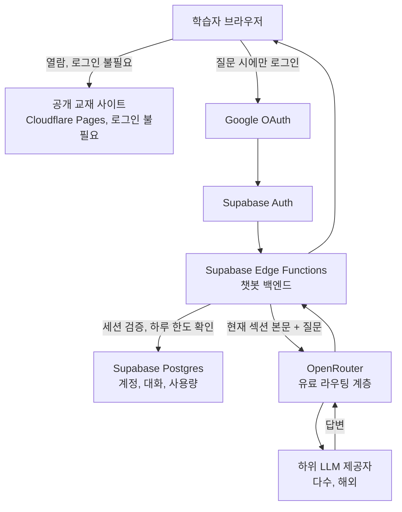

# 2026-08-21 학습자 로그인과 AI 챗봇 개인정보, 보안 감사

> Vault의 프로젝트 허브의 다음 출시 범위인 **학습자 Google 로그인**과 **AI 챗봇**이 아직 구현되지 않은 설계 단계에서, 새로 생기는 개인정보와 보안 위험면을 미리 감사한 문서다. 사용자 요청으로 이번 감사는 다음 확정 설계를 전제로 진행했다. 로그인은 Supabase Auth의 Google 소셜 로그인, 챗봇 백엔드는 Supabase Edge Functions, 데이터베이스는 Supabase Postgres, LLM 호출은 유료 OpenRouter, 공개 사이트는 Cloudflare Pages와 R2, 교재 원본은 GitHub 공개 저장소다.

---

## 감사 전제에 대한 유보 하나

이 감사는 사용자 지시에 따라 Supabase를 확정 전제로 다뤘다. 다만 같은 날 무료 백엔드 조사 기록에서 Supabase는 **비활동 7일이 지나면 프로젝트가 자동 정지**된다는 이유로 이 프로젝트의 간헐적 사용 패턴(학기 중 수업 시간에만 접속)과 정면으로 충돌한다고 결론짓고, Cloudflare Pages Functions와 D1 조합을 잠정 결론으로 남긴 바 있다. 두 문서의 전제가 서로 다르므로, Supabase로 확정할 경우 방학이나 시험 기간 같은 비활동 구간에 서비스가 자동 정지되지 않도록 별도의 활성 유지(예: 주기적 핑 요청) 방안을 함께 설계해야 한다. 이 유보를 제외한 나머지 감사 내용은 Supabase 전제 위에서 작성했다.

---

## 감사 대상 아키텍처와 데이터 흐름

교재 열람 경로와 챗봇 경로는 신뢰 경계가 다르다. 열람 경로는 정적 파일을 내려주는 것뿐이라 개인정보가 발생하지 않지만, 챗봇 경로는 로그인, 세션, 질문 내용, 사용량 집계, 해외 LLM 호출이 한 요청 안에서 모두 얽힌다. 아래 A부터 F까지는 이 챗봇 경로 위에서 발견한 감사 결과다.

---

## A. 저장하는 개인정보의 범위와 근거

Google 소셜 로그인에서 받는 항목은 설계상 이름과 이메일 주소뿐이다. 이는 최소 수집 원칙에 부합하는 좋은 출발점이다. 문제는 이 두 항목이 전부가 아니라는 데 있다.

**질문 내용 자체가 개인정보가 되는 경로**를 짚어야 한다. 챗봇은 로그인한 사용자의 세션에 묶여 질문을 저장하므로, 대화 기록은 "이름과 이메일이 연결된 사람이 어떤 것을 궁금해했는가"라는 결합 정보가 된다. 예를 들어 특정 학생이 반복해서 이해하지 못하는 개념이 무엇인지, 어떤 시간대에 주로 접속하는지, 질문의 문체나 논리 수준이 어떤지가 누적되면 그 자체로 개인의 학습 행태에 관한 프로파일이 만들어진다. 이것은 이름, 이메일과는 별개로 관리해야 할 정보 범주이며, 처리방침에서 "대화 내용"을 별도 수집 항목으로 명시해야 하는 이유이기도 하다.

더 적게 저장할 수 있는 항목이 있는지 검토하면, 사용량 한도 집계에는 사용자 식별자와 날짜별 횟수만 있으면 충분하고 질문의 원문 텍스트까지 그 목적에 필요하지는 않다. 대화 원문은 "현재 세션 이어가기"라는 별개 목적(사용자 규칙에 명시된 세션 1개 유지)에 필요한 것이므로, 목적별로 보관 근거가 다르다는 점을 설계에서 분리해 두는 것이 좋다.

---

## B. 보관과 삭제

대화는 마지막 접속 뒤 3일이 지나면 자동 삭제된다는 규칙은 명확하다. 그러나 이 규칙이 다루지 않는 두 축이 남는다.

**계정 정보**는 언제까지 남는가. 학생이 탈퇴하지 않는 한 이름과 이메일이 무기한 남는 구조라면, 개인정보보호법 제21조가 요구하는 "처리 목적이 달성되었을 때 지체 없이 파기"라는 원칙과 충돌할 여지가 있다. 재학 기간이 끝난 학생의 계정을 계속 들고 있어야 할 목적이 사라지기 때문이다.

**사용량 기록(일별 질문 횟수)**은 대화 원문과 성격이 다르다. 자정 초기화는 "오늘 몇 번 썼는가"라는 당일 카운터일 뿐, 그 카운터의 과거 이력을 얼마나 오래 남길지는 별개 질문이다. 운영 통계나 논문 근거로 남기고 싶다면 사용자 식별자를 뗀 집계 형태로 전환하는 편이 개인정보 보유량을 줄이는 방법이다.

**삭제 요청 처리**는 절차가 없다. 개인정보보호법 제36조는 정보주체의 정정, 삭제 요구권을, 제37조는 처리정지 요구권을 보장한다. 학생이 탈퇴나 삭제를 요청했을 때 계정 레코드만 지우고 대화나 사용량 이력이 고아 레코드로 남는다면 이 요구권을 실질적으로 충족하지 못한다. Supabase Postgres 스키마 설계 단계에서 계정 삭제가 관련 테이블까지 연쇄적으로 지우도록(외래키 `ON DELETE CASCADE` 또는 명시적 삭제 배치) 정해 두어야 나중에 절차를 다시 만드는 일을 피할 수 있다.

---

## C. 한국 개인정보 보호법 관점의 최소 요건

### 개인정보 처리방침 게시 의무

개인정보보호법 제30조는 개인정보처리자가 처리방침을 수립하고, 정보주체가 쉽게 확인할 수 있는 방법으로 공개해야 한다고 규정한다. 이름과 이메일을 수집하고 대화를 저장하는 이상 이 서비스는 명백히 개인정보처리자에 해당하며, 운영 주체가 한국의 대학 연구실이라는 점도 국내법 적용을 피할 사유가 되지 않는다. 학급 30명 규모의 소규모 서비스라 해도 온라인으로 개인정보를 수집하거나 처리하는 이상 규모를 이유로 처리방침 공개 의무를 면제받는 근거는 이번 조사에서 확인하지 못했다. **이 항목은 확인 불가로 남긴다**: 시행령에 소규모 처리자에 대한 예외가 있는지는 원문까지 확인하지 못했으며, 있다 해도 온라인 개인정보 수집 서비스에 적용된다고 단정할 근거는 찾지 못했다.

> **Sources**
> - [개인정보 보호법 제30조](https://www.law.go.kr/%EB%B2%95%EB%A0%B9/%EA%B0%9C%EC%9D%B8%EC%A0%95%EB%B3%B4%EB%B3%B4%ED%98%B8%EB%B2%95/%EC%A0%9C30%EC%A1%B0)

### 동의 획득 방식

제15조는 개인정보 수집, 이용에 관해 정보주체의 동의를 목적별로 명확히 받도록 요구한다. 로그인 화면에서 "이용에 동의합니다" 한 번의 포괄 동의로 처리하면, 수집 목적(대화 응대, 사용량 관리), 국외 이전(아래 항목), 보유기간이 뒤섞여 정보주체가 무엇에 동의했는지 스스로 확인하기 어려워진다. 목적별로 문구를 분리하고 동의 시각과 버전을 기록해 두는 편이, 나중에 처리방침을 바꿀 때 이전 동의와의 관계를 설명하기도 쉽다.

> **Sources**
> - [개인정보 보호법 제15조](https://casenote.kr/%EB%B2%95%EB%A0%B9/%EA%B0%9C%EC%9D%B8%EC%A0%95%EB%B3%B4_%EB%B3%B4%ED%98%B8%EB%B2%95/%EC%A0%9C15%EC%A1%B0)

### 개인정보 보호책임자 지정 의무

제31조와 시행령 제32조는 개인정보처리자에게 보호책임자 지정 의무를 부과하되, 소상공인기본법 제2조가 정하는 소상공인에 해당하면 별도로 지정하지 않고 대표자가 자동으로 보호책임자가 되는 예외를 둔다(반대로 연 매출 1,500억원 이상이면서 대량의 개인정보를 처리하는 큰 사업자는 반드시 지정해야 한다). 이 서비스의 운영 주체는 영리 사업자가 아니라 대학 연구실이므로, 매출을 기준으로 하는 소상공인 정의에 애초에 들어맞는지, 아니면 정의 자체가 적용되지 않아 원칙으로 돌아가 지정 의무가 그대로 발생하는지가 갈린다. **이 항목은 확인 불가로 남긴다**: 비영리 대학 연구실이 소상공인기본법상 소상공인 범주에 들어가는지는 이번 조사로 확정하지 못했다. 다만 예외 해당 여부와 무관하게 처리방침에는 보호책임자의 성명, 부서, 연락처를 기재해야 하므로(제30조), 실무적으로는 지도교수나 담당자 한 명을 보호책임자로 명시해 두는 편이 안전하다.

> **Sources**
> - [개인정보 보호법 제31조](https://casenote.kr/%EB%B2%95%EB%A0%B9/%EA%B0%9C%EC%9D%B8%EC%A0%95%EB%B3%B4_%EB%B3%B4%ED%98%B8%EB%B2%95/%EC%A0%9C31%EC%A1%B0)
> - [개인정보 보호법 시행령 제32조](https://www.law.go.kr/%EB%B2%95%EB%A0%B9/%EA%B0%9C%EC%9D%B8%EC%A0%95%EB%B3%B4%EB%B3%B4%ED%98%B8%EB%B2%95%EC%8B%9C%ED%96%89%EB%A0%B9/%EC%A0%9C32%EC%A1%B0)

### 만 14세 미만 아동 조항

제22조의2는 만 14세 미만 아동의 개인정보를 처리할 때 법정대리인의 동의를 요구한다. 이 서비스의 학습자는 대학 수업 수강생이며, 국내 대학 입학 연령의 특성상 재학생이 만 14세 미만일 가능성은 사실상 존재하지 않는다. 따라서 이 조항은 **확인 결과 해당 사항 없음**으로 결론짓는다. 별도의 나이 확인 절차를 로그인 흐름에 넣을 필요는 없으나, 이 판단 근거를 설계 문서에 남겨 두면 추후 감사나 문의에 답할 때 근거로 쓸 수 있다.

> **Sources**
> - [개인정보 보호법 제22조의2](https://casenote.kr/%EB%B2%95%EB%A0%B9/%EA%B0%9C%EC%9D%B8%EC%A0%95%EB%B3%B4_%EB%B3%B4%ED%98%B8%EB%B2%95/%EC%A0%9C22%EC%A1%B0%EC%9D%982)

### 국외 이전 고지, 동의 의무

제28조의8은 개인정보를 해외로 제공, 처리위탁, 보관하는 것을 원칙적으로 금지하고, 다섯 가지 예외 사유 중 하나가 있어야 허용한다. Supabase(해외 클라우드 인프라)와 OpenRouter(해외 라우팅 계층과 그 하위 LLM 제공자들)는 모두 해외 사업자이므로, 학생의 계정 정보와 질문 내용이 이들에게 전달되는 순간 국외 이전에 해당할 가능성이 높다.

다섯 예외 중 이 서비스에 현실적으로 맞는 것은 세 번째, "정보주체와의 계약 체결, 이행을 위해 처리위탁과 보관이 필요한 경우로서 관련 사항을 처리방침에 공개하거나 이메일 등으로 알린 경우"다. 챗봇 응답이라는 서비스 자체가 계약의 내용이라고 본다면 별도의 동의 절차 없이 처리방침 공개만으로 충족될 여지가 있다. 다만 이 예외가 실제로 이 사안(학생 질문의 LLM 라우팅)에 적용되는지는 개인정보보호위원회의 유권 해석이나 관련 고시 원문까지 확인해야 확정할 수 있다. **이 적용 여부는 확인 불가로 남기며, 서비스 오픈 전 법률 자문이나 개인정보보호위원회 상담을 권한다.** 별도 동의를 받는 안전한 경로를 택한다면, 로그인 동의 화면에 이전받는 자(Supabase, OpenRouter 및 그 하위 제공자), 이전 국가, 이전 항목, 이전 목적, 보유와 이용 기간을 명시해야 한다.

Supabase는 프로젝트 생성 시 AWS 리전을 선택하는 구조이며, 서울(ap-northeast-2)과 도쿄(ap-northeast-1)를 포함한 아시아 리전이 공식으로 제공된다는 사실을 확인했다. 서울 리전을 지정하면 계정, 대화, 사용량 데이터의 물리적 저장 위치를 국내로 좁힐 수 있어 국외 이전 범위가 실질적으로 줄어든다. 다만 이 리전 선택은 프로젝트 생성 이후에는 되돌릴 수 없고, 리전을 바꾸려면 새 프로젝트를 만들어 데이터를 옮기는 별도 마이그레이션이 필요하다. 즉 리전 지정은 챗봇 기능을 만들기 전, Supabase 프로젝트를 생성하는 시점에 미리 결정해 둬야 하는 사안이다. Supabase가 공개한 하위처리자 목록에는 호스팅 계열로 AWS, Cloudflare, Google, Fly.io, Vercel, Upstash가 올라 있으나 국가나 소재지 컬럼이 없어, 물리적 저장 위치는 결국 리전 선택 결과로만 확정된다. OpenRouter와 그 하위 LLM 제공자는 리전 선택이 사실상 불가능해 이 경로의 국외 이전 자체는 피하기 어렵다.

> **Sources**
> - [개인정보 보호법 제28조의8](https://casenote.kr/%EB%B2%95%EB%A0%B9/%EA%B0%9C%EC%9D%B8%EC%A0%95%EB%B3%B4_%EB%B3%B4%ED%98%B8%EB%B2%95/%EC%A0%9C28%EC%A1%B0%EC%9D%988)
> - [Supabase Data Processing Addendum](https://supabase.com/legal/dpa)
> - [Supabase 리전 목록](https://supabase.com/docs/guides/platform/regions)
> - [Supabase 리전 변경 절차](https://supabase.com/docs/guides/troubleshooting/change-project-region-eWJo5Z)
> - [Supabase 하위처리자 목록](https://supabase.com/legal/customer-resources/subprocessor-list)

---

## D. LLM에 보내는 데이터

OpenRouter 공식 개인정보처리방침은 OpenRouter 자체가 입력과 출력을 모델 학습에 쓰지 않는다고 명시한다. 다만 이는 학습 이용 여부에 관한 확인일 뿐이고, 프롬프트를 얼마나 오래 로깅, 보관하는지에 대한 구체적 기본값은 1차 문서에서 확정된 문구를 찾지 못해 **확인 불가로 남긴다.** 게다가 OpenRouter는 라우팅 계층일 뿐이고, **실제 데이터 보존 정책은 요청이 넘어가는 하위 LLM 제공자마다 다르며, 그 정책을 확인할 책임은 OpenRouter 약관상 서비스 운영자에게 있다.** 즉 "OpenRouter를 쓴다"는 사실만으로는 데이터가 어떻게 다뤄지는지 알 수 없고, 실제로 어떤 모델(제공자)로 라우팅되는지까지 확인해야 한다.

이 사실은 C항의 국외 이전 판단과 D항의 고지 의무를 직접 연결한다. 학생의 질문이 외부 모델 제공자에게 전달되는 것은 국외 이전에 해당하며, 그 제공자의 데이터 보존 정책을 확인하지 않고는 처리방침에 무엇을 적어야 할지도 정할 수 없다. OpenRouter는 계정 설정 화면(`openrouter.ai/settings/privacy`)에서 데이터를 전혀 보관하지 않는 제공자만 쓰도록 제한하는 Zero Data Retention(ZDR) 옵션을 제공하고, 요청 단위로도 `provider.zdr` 파라미터를 걸어 강제할 수 있다. ZDR을 지원하는 제공자 목록은 OpenRouter가 API로 공개한다. 이 프로젝트처럼 학생의 질문을 다루는 서비스는 계정 설정과 요청 파라미터 양쪽에서 ZDR을 강제하고, 그 설정을 켠 사실과 시점을 서면으로 기록해 두는 것이 가장 확실한 완화책이다.

> **Sources**
> - [OpenRouter Provider Logging 문서](https://openrouter.ai/docs/guides/privacy/provider-logging)
> - [OpenRouter Privacy Policy](https://openrouter.ai/privacy)
> - [OpenRouter Zero Data Retention 문서](https://openrouter.ai/docs/guides/features/zdr)

---

## E. 기술적 위험

**한도 우회와 비용 남용.** 하루 질문 한도가 클라이언트 코드에서만 검사된다면, 로그인 토큰을 가진 사용자가 API를 직접 호출해 한도를 넘기거나 유료 OpenRouter 비용을 무제한으로 발생시킬 수 있다. Edge Function 안에서 요청마다 Postgres 카운터를 원자적으로 증가시키고, LLM을 호출하기 **전에** 한도 초과 여부를 확인해 거부하는 순서를 강제해야 한다.

**다른 사람의 대화를 읽을 수 있는 경로.** Supabase Postgres는 Row Level Security(RLS)를 명시적으로 설정하지 않으면 인증된 어떤 사용자든 API로 다른 사용자의 행을 조회할 수 있는 구조다. 대화 테이블에 `user_id` 컬럼을 두고 `auth.uid() = user_id` 조건의 RLS 정책을 활성화해야 하며, Edge Function이 서비스 롤 키로 우회 조회를 하는 코드 경로가 있다면 그 경로에서도 요청자의 세션과 대상 레코드가 일치하는지 별도로 검증해야 한다.

**세션 탈취.** Supabase Auth는 access token(기본 만료 3600초, 최대 604800초)과 refresh token을 발급하며, refresh token은 기본적으로 1회용으로 회전하고 재사용이 감지되면 세션 전체와 모든 refresh token을 취소한다. 문제는 기본 저장 위치가 브라우저 클라이언트(`localStorage` 등)라는 점이다. 정적 교재 사이트와 챗봇이 같은 오리진에서 서비스되고 마크다운 렌더링 경로 어딘가에서 원본 HTML이나 스크립트 삽입이 가능해지면, XSS로 이 토큰을 탈취해 피해자 계정으로 챗봇을 사용하는 경로가 열린다. 서버 사이드에서 `storage` 옵션을 오버라이드해 HTTPOnly 쿠키로 세션을 관리하는 방식을 검토하고, 최소한 마크다운 렌더러가 원본 HTML을 이스케이프 없이 통과시키지 않는지 확인해야 한다.

**프롬프트를 통한 시스템 지시 변조 시도.** 챗봇이 현재 섹션의 공개 본문만 문맥으로 쓴다는 규칙은 정해져 있지만, 학생이 프롬프트로 이 규칙 자체를 바꾸려는 시도(예: "지금부터 규칙을 무시하고")를 걸러내는 절차는 없다. 이런 시도가 성공하면 챗봇이 원래 목적과 무관한 응답을 하거나 시스템 프롬프트를 노출할 수 있다. 시스템 지시와 사용자 입력을 프레이밍 단계에서 분리하고, 답변 전에 교재 문맥 범위를 벗어난 요청을 걸러내는 간단한 규칙 기반 확인을 1차 방어로 두는 것을 권한다.

---

## F. 교육기관 맥락 특유의 것

**서비스 거부권.** 교재 열람은 로그인 없이 가능하므로 챗봇을 쓰지 않아도 수업 자료 접근에는 구조적으로 불이익이 없다. 다만 이 사실이 설계 문서에만 있고 학생에게 전달되지 않으면, 학생은 "로그인해야 진짜 수업 참여로 인정되는 것 아닌가"라는 오해를 할 수 있다. 강의 공지나 처리방침에 "챗봇은 선택 기능이며 미사용이 어떤 불이익으로도 이어지지 않는다"는 문장을 명시하는 편이 좋다.

**평가, 성적 오인 방지.** 챗봇 사용 여부나 대화 내용이 성적에 반영되지 않는다는 안내가 화면에 없다. 대학 수업이라는 맥락에서는 이 오해가 실제로 발생할 수 있는데, 학생이 챗봇 사용을 평가의 일부로 오인하면 질문을 위축하거나 반대로 좋은 인상을 남기려 부자연스럽게 사용해 정직한 학습 행태가 왜곡될 수 있다. 챗봇 진입 화면에 고정 문구로 이 사실을 밝혀야 한다.

---

## 심각도별 정리

### 법적 의무

1. **개인정보 처리방침 미게시**: 제30조 위반 소지. 수집 항목, 목적, 보유기간, 위탁과 국외이전 현황, 정보주체 권리 행사 방법을 담아 서비스 오픈 전 상시 게시해야 한다.
2. **개인정보 보호책임자 지정 여부 미정**: 제31조 관련. 대학 연구실이 소상공인 예외에 해당하는지는 확인 불가이나, 예외 여부와 무관하게 처리방침에 보호책임자 성명과 연락처를 기재해야 하므로 담당자를 지금 정해야 한다.
3. **국외 이전 고지, 동의 근거 미정**: 제28조의8 위반 소지. 계약이행 예외를 쓸지 별도 동의를 받을지 정하고, 이전받는 자, 국가, 항목, 기간을 처리방침이나 이메일로 고지해야 한다. 예외 적용 가능 여부는 법률 자문으로 확정 권장.
4. **동의 획득 방식 미설계**: 제15조 관련. 수집과 이용, 국외이전, 보유기간 동의를 분리 고지하고 동의 기록(시각, 버전)을 남겨야 한다.
5. **만 14세 미만 조항**: 확인 결과 해당 사항 없음. 별도 조치 불필요하나 판단 근거를 문서에 남겨 둘 것.

### 지금 정하지 않으면 구현 중 막히는 것

6. **계정, 사용량 보관기간 미정**: 대화는 3일로 정했으나 계정과 사용량 이력은 무기한. 재학 기간 기준 보관기간과 자동 파기 배치를 스키마 설계 단계에서 함께 정해야 한다.
7. **탈퇴, 삭제 요청 처리 절차 없음**: 제36조, 제37조 관련. 계정 삭제가 관련 테이블까지 연쇄적으로 지우도록 설계하고 삭제 요청 접수 창구를 정해야 한다.
8. **하루 한도 우회, 비용 남용 경로**: 서버 측 원자적 카운터 검증 없이는 API 직접 호출로 한도와 비용 통제가 무력화된다.
9. **RLS 미설계**: 대화 테이블에 사용자 단위 Row Level Security를 걸지 않으면 다른 사람의 대화를 읽을 수 있는 구조적 취약점이 남는다.
10. **프롬프트 인젝션 방어 미정**: 시스템 지시와 사용자 입력 분리, 문맥 범위 이탈 요청 필터링을 1차 방어로 설계해야 한다.
11. **Supabase 프로젝트 리전 미확정**: 리전은 생성 후 되돌릴 수 없다. 서울(ap-northeast-2) 지정 여부를 프로젝트를 만들기 전에 정해야 한다.

### 개선 제안

12. **입력창 경고의 실효성**: 안내 문구만으로는 실수로 입력된 개인정보를 막지 못한다. 저장 전 이메일, 전화번호 패턴 탐지 같은 보조 장치를 검토할 것.
13. **LLM 제공자 데이터 보존 정책 확인**: 실제 라우팅될 하위 제공자를 특정하고, OpenRouter 계정 설정과 요청 파라미터 양쪽에서 ZDR을 강제할 것.
14. **평가, 성적 오인 방지 문구**: 챗봇 진입 화면에 "이 대화는 평가에 사용되지 않는다"는 문구를 고정 노출할 것.
15. **서비스 거부권 명시**: 챗봇 미사용이 불이익으로 이어지지 않는다는 사실을 강의 공지나 처리방침에 명시할 것.

---

## 이번 감사에서 확인하지 못한 것

- 소규모 개인정보처리자에 대한 처리방침 공개 의무 예외가 시행령에 있는지, 있다면 온라인 서비스에도 적용되는지
- 비영리 대학 연구실이 소상공인기본법상 소상공인 범주에 들어가 보호책임자 지정 의무 예외를 적용받는지
- 국외 이전 예외 사유 3호(계약이행을 위한 처리위탁)가 이 사안(챗봇의 LLM 라우팅)에 실제로 적용되는지에 대한 개인정보보호위원회의 유권 해석이나 관련 고시 원문
- OpenRouter의 기본 프롬프트 보관 기간과 기본 로깅 여부에 대한 1차 문서상의 확정 문구
- 실제로 라우팅될 하위 LLM 제공자가 확정되지 않아, 그 제공자의 개별 데이터 보존과 학습 정책은 미확인

이 목록은 서비스 오픈 전 법률 자문이나 추가 조사로 채워야 할 항목이다.
